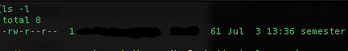
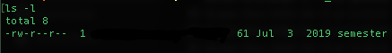
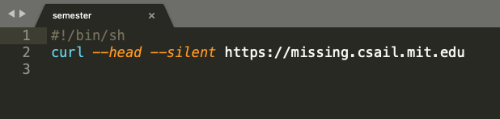
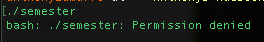
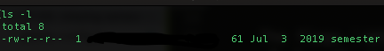
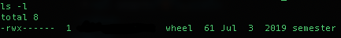

I recently discovered a nice, short course freely available by MIT called [Missing Semester](https://missing.csail.mit.edu/). It's a pragmatic course for computer science students to become acquanted with tools that they will be using every day on the job. It's a nice departure from the theoretical topics of a CS degree. I don't have a CS degree, but nonetheless I found this course to be interesting and useful.

There are a total of eleven lessons each lasting about an hour. If you navigate to the Missing Semester website, you will see that they offer challenges at the end of each lesson. I haven't found an answers key for this particular course, so I'd like to document my answers in a series of blog posts. I encourage anyone to provide constructive criticisms, comments, or suggestions. 

## [Lesson 1: Course overview + the shell](https://missing.csail.mit.edu/2020/course-shell/)

### Challenges

1. Create a new directory called `missing` under `/tmp`

	This is pretty straightforward:
	`mkdir missing /tmp`

2. Look up the `touch` program. The `man` program is your friend.

	When I do this, I get a lot of information about the program. It includes a definition, description, and list of options. The command is known to create files, but according to the `man` page it can also be used to change the modification and access time of a file. In question three below, we are asked to make a file called `semester` and when I do that, we see the following timestamp:
	
	

	After running the command `touch -mt 201907030000 semester` the timestamp now looks like this:

	

	(help with this syntax found [here](https://hackernoon.com/how-to-change-a-file-s-last-modified-and-creation-dates-on-mac-os-x-494f8f76cdf4))
	
	The flags `-mt` are for modify and time, and as can be seen we have changed the modification time of when the `semester` file was created to a different timestamp.

3. Use `touch` to create a new file called `semester` in missing.

	My answer:
	
	`touch semester ./missing`

4. Write the following into that file, one line at a time:
	`
	#!/bin/sh
	curl --head --silent https://missing.csail.mit.edu
	`

	My answer:

	`echo '#!/bin/sh' >> semester
	 echo 'curl --head --silent https://missing.csail.mit.edu' >> semester`

	The result looks like this:

	

5. Try to execute the file, i.e. type the path to the script (`./semester`) into your shell and press enter. Understand why it doesn’t work by consulting the output of ls (hint: look at the permission bits of the file).
	
	When I try to execute the script via `./semester` I am met with this:
	

	If I check the permissions of the file by typing `ls -l` I see this:
	

	This tells me that the file only has read and write permissions (denoted by the first `rw`), but no executable (`x`) permission.

6. Run the command by explicitly starting the `sh` interpreter, and giving it the file `semester` as the first argument, i.e. `sh semester`. Why does this work, while `./semester` didn’t?

	By running the command `sh semester` the file is executed and a `curl` request is made for the end point which displays the request data in the shell. `./semester` isn't executable because of the file permissions. `sh` works because we are passing the file to the interpreter as an argument, so it will execute the script. ([resource](https://apple.stackexchange.com/questions/101170/why-do-i-need-to-put-sh-before-running-sh-files) for this explanation)

7. Look up the `chmod` program (e.g. use `man chmod`).

	Looking at the `man` page for `chmod`, it says that the program is used to change file modes or [Access Control Lists](https://en.wikipedia.org/wiki/Access-control_list). This is a very detailed `man` page that gives a lot of useful information and examples.

8. Use `chmod` to make it possible to run the command `./semester` rather than having to type `sh semester`. How does your shell know that the file is supposed to be interpreted using `sh`? See this page on the [shebang](https://en.wikipedia.org/wiki/Shebang_(Unix)) line for more information.

	My answer:
	What we need to do is make the `semester` file executable. To do this I can run the command `chmod 0100 semester` and this allows me to execute the `semester` command successfully. After changing the permissions, I run `ls -l` and see this:

	

9. Use `|` and `>` to write the “last modified” date output by `semester` into a file called `last-modified.txt` in your home directory.

	My answer:
	`date -r semester > ~/last-modified.txt`

	I'm not sure how I could use the pipe operator in this context so any suggestions are welcome. 

